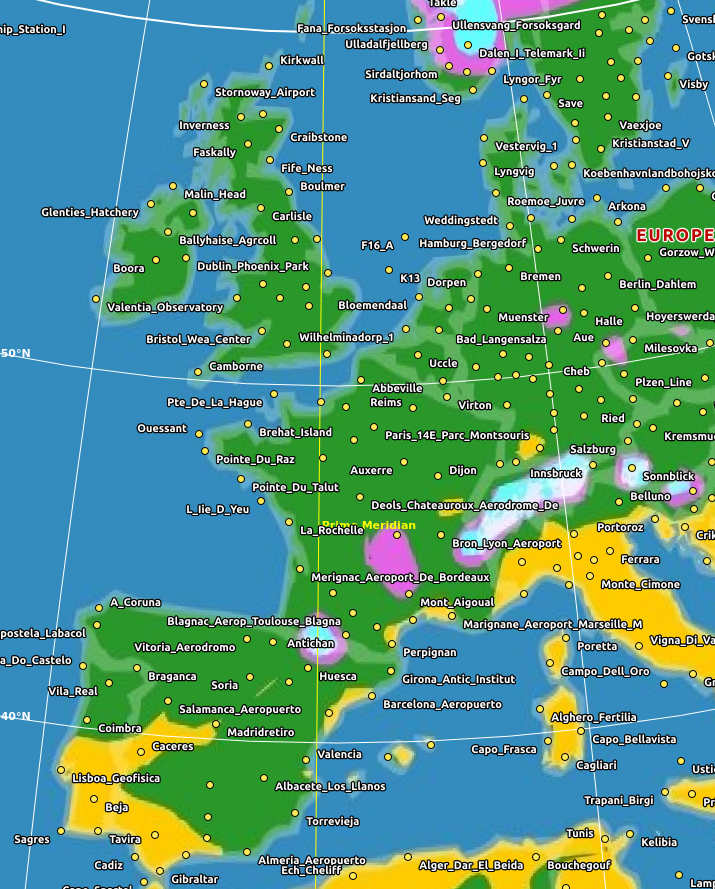

This is a commandline tool to plot global temperature data using data from the Global Historical Climatology Network.

See https://www.ncei.noaa.gov/pub/data/ghcn/v4

Installation
============

To compile from source first install the prerequisites:

On a Debian based system:

``` bash
sudo apt-get install build-essential gnuplot wget marble python3
```

On Arch/Parabola:

``` bash
sudo pacman -S gnuplot wget marble python
```

Obtaining the data
==================

Before you begin you'll need to download the latest version of the GHCN version 4 data.  tempgraph needs three files: the country codes, the weather stations and the temperature data itself.  These files can be obtained here:

```bash
mkdir data
cd data
wget https://www.ncei.noaa.gov/pub/data/ghcn/v4/ghcnm.tavg.latest.qcf.tar.gz
wget https://www.ncei.noaa.gov/pub/data/ghcn/v4/ghcnm-countries.txt
tar -xzvf ghcnm.tavg.latest.qcf.tar.gz
cd ..
```

The compressed archive contains two files, one which is the temperature data (.dat) and the other which contains details of the weather stations (.inv). I typically rename these to:

```bash
cp data/ghcnm.v4*/*.dat data/v4.mean
cp data/ghcnm.v4*/*.inv data/wmo.txt
cp data/ghcnm-countries.txt data/v4.country.codes
```

Usage
=====

``` bash
python3 tempgraph2.py
ls *.kml *.jpg
```
